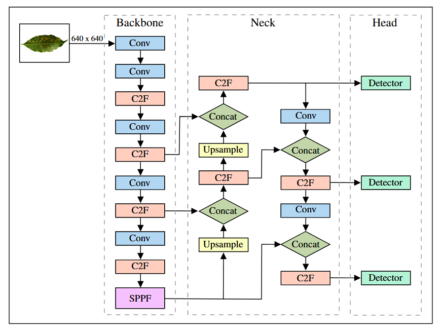

## Introduction
we present YOLO-CoffeeRust, a deep learning–based detection model specifically designed for the automatic identification of coffee leaf rust.
YOLO-CoffeeRust extends the YOLOv8 backbone to accurately detect rust-affected regions on coffee leaves,
while retaining the original object detection branch for real-time disease identification.
The main contributions of YOLO-CoffeeRust are as follows:
*	**Adapting the YOLOv8 architecture for coffee leaf rust detection**
*	**Developing a robust object detection model for identifying rust-affected regions**
*	**Training and evaluating the model using annotated coffee leaf datasets**
*	**Achieving accurate and efficient coffee rust detection for agricultural applications**

 <h4>The architecture of YOLO </h4> 

### Visualization
